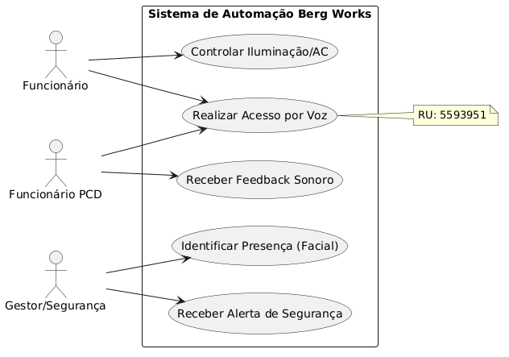
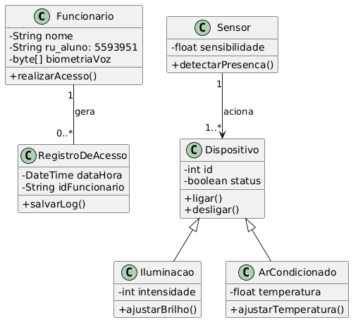

# Sistema de Automação Berg Works 🏢

Projeto prático desenvolvido para a disciplina de **Análise e Modelagem de Sistemas** no Centro Universitário Internacional (UNINTER).

## 📊 Visualização dos Diagramas

### Diagrama de Caso de Uso

### Diagrama de Classes

## 📁 Documentação Técnica
* 📂 [Scripts PlantUML na pasta /modelagem](./modelagem/)
* 📄 [Documento PDF Oficial](./AtividadePratica_AnaliseSistemas_RuiEricMelo_5593951.pdf)

---
**Aluno:** Rui Eric Feitoza Melo | **RU:** 5593951
